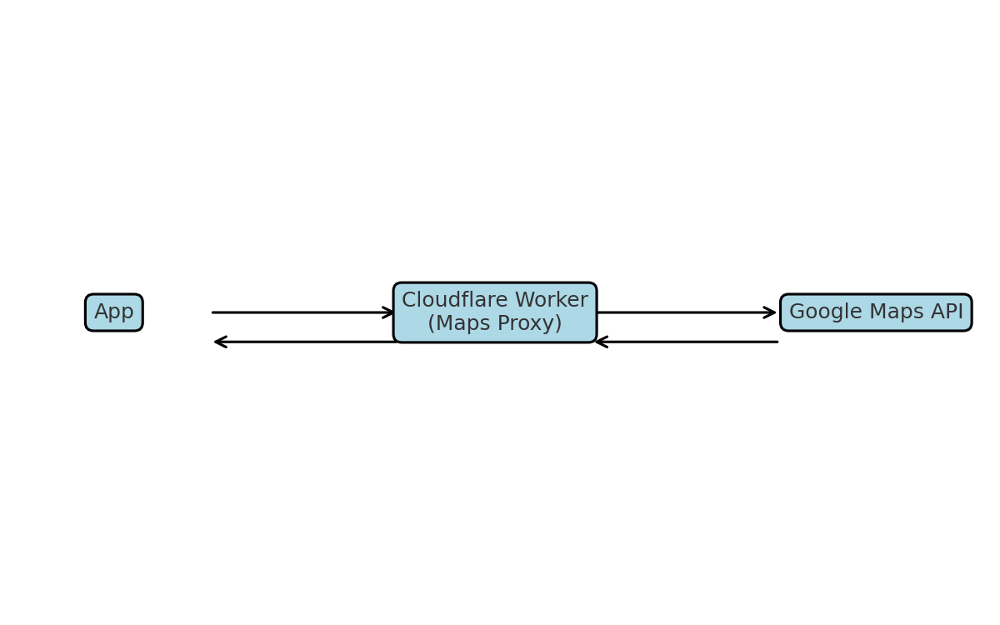

# Maps Proxy

Proxy para chamadas à API do Google Maps, implementado como **Cloudflare Worker**.

Este projeto possui dois ambientes configurados:
- **dev** → para desenvolvimento e testes
- **prod** → para produção (com domínio `atipicali.com`)

O código-fonte é o mesmo para ambos; a diferença principal é a variável secreta `GOOGLE_MAPS_API_KEY`.

---

## 📋 Diagrama de arquitetura



---

## 📦 Pré-requisitos

- Node.js 18+
- Wrangler CLI instalado:
  ```bash
  npm install -g wrangler
  ```
- Conta no [Cloudflare](https://dash.cloudflare.com/) com acesso a Workers
- Domínio `atipicali.com` já configurado no Cloudflare (para prod)

---

## ⚙️ Configuração

### 1. Login no Cloudflare
```bash
wrangler login
wrangler whoami
```

---

### 2. Estrutura de ambientes (`wrangler.jsonc`)

O arquivo já está configurado para dois ambientes:

```jsonc
{
  "$schema": "node_modules/wrangler/config-schema.json",
  "name": "maps-proxy-dev",
  "main": "src/index.js",
  "compatibility_date": "2025-05-29",
  "observability": { "enabled": true },

  "env": {
    "dev": {
      "name": "maps-proxy-dev",
      "workers_dev": true
    },
    "prod": {
      "name": "maps-proxy",
      "workers_dev": false,
      "route": "atipicali.com/maps-proxy/*",
      "zone_name": "atipicali.com"
    }
  }
}
```

---

### 3. Configuração das **Secrets**

Cada ambiente usa sua própria `GOOGLE_MAPS_API_KEY`.

```bash
# Ambiente DEV
wrangler secret put GOOGLE_MAPS_API_KEY --env dev
# cole aqui a chave de desenvolvimento

# Ambiente PROD
wrangler secret put GOOGLE_MAPS_API_KEY --env prod
# cole aqui a chave de produção
```

> **Importante:** não coloque a chave diretamente no código ou no `wrangler.jsonc`.

---

## 🚀 Deploy

### Dev
```bash
wrangler deploy --env dev
```
URL gerada:
```
https://maps-proxy-dev.<subdominio>.workers.dev
```

### Prod
```bash
wrangler deploy --env prod
```
URL:
```
https://atipicali.com/maps-proxy
```

---

## 🧪 Testes

### Dev
```bash
curl "https://maps-proxy-dev.<subdominio>.workers.dev/?q=ping"
wrangler tail --env dev
```

### Prod
```bash
curl "https://atipicali.com/maps-proxy/?q=ping"
wrangler tail --env prod
```

---

## 🛡️ Boas práticas

- **Nunca** commit a sua `GOOGLE_MAPS_API_KEY`
- Use `wrangler secret put` para gerenciar secrets
- Mantenha `wrangler.jsonc` como a **fonte da verdade** para variáveis normais (`vars`)
- Se for editar variáveis pelo Dashboard, ative `keep_vars` para evitar sobrescrita

---

## 📄 Licença
Este projeto é privado e de uso interno.

